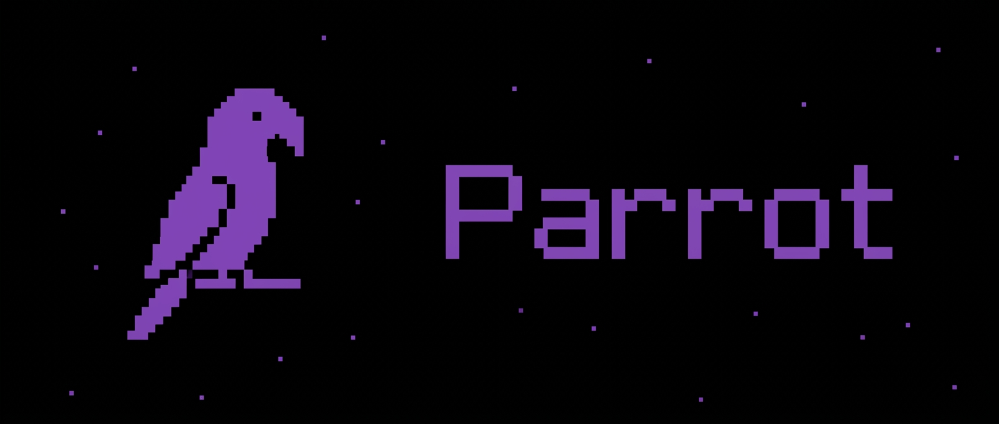
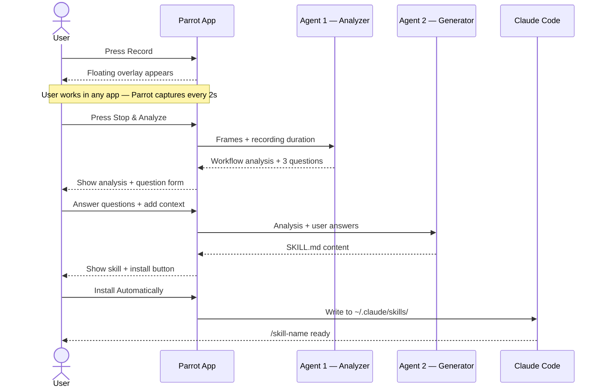
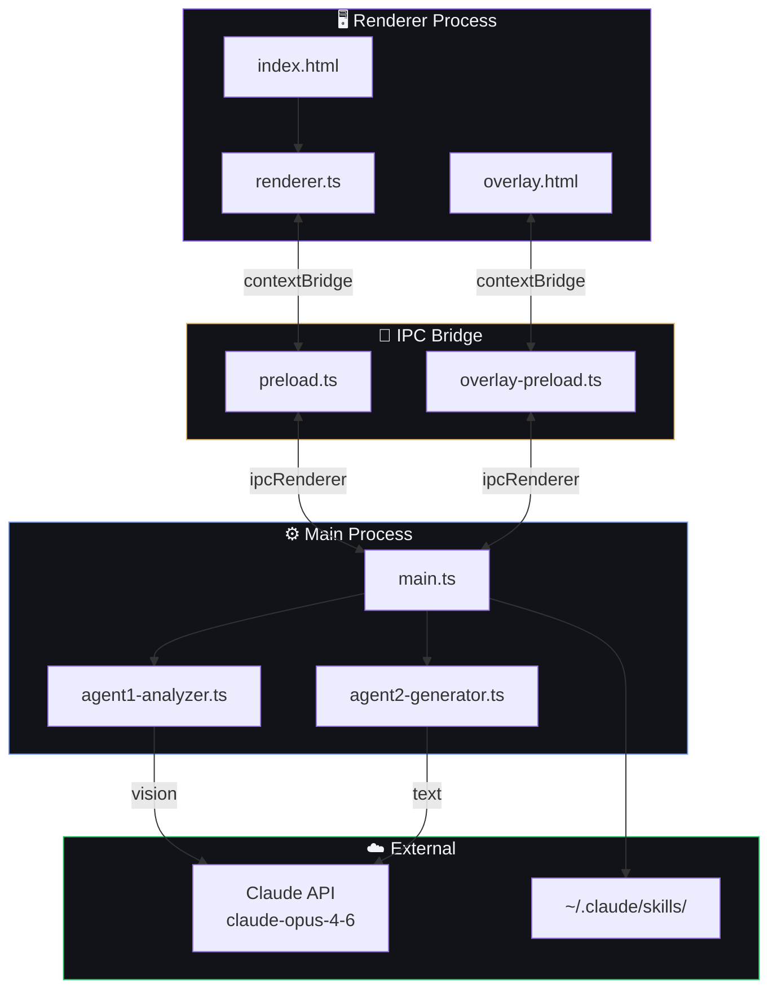
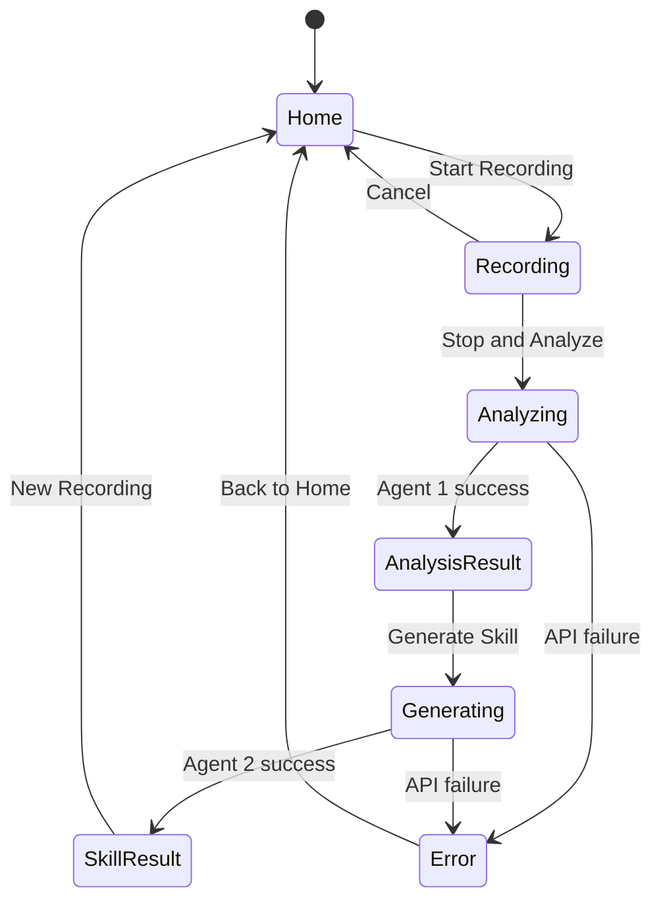
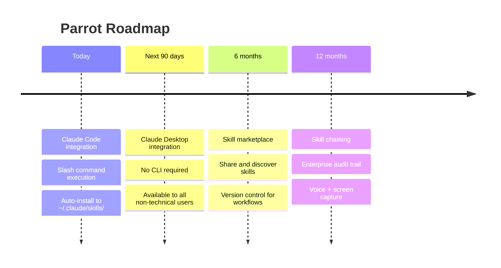

<div align="center">



# PARROT

### *Record once. Automate forever.*

**Turn screen recordings into AI-executable skills — no code required.**

[](https://www.electronjs.org/)
[](https://www.typescriptlang.org/)
[](https://anthropic.com)
[](LICENSE)

</div>

---

## What is Parrot?

Parrot bridges the gap between **human expertise** and **AI execution**.

You record your screen while doing any repetitive workflow. Parrot's AI pipeline — powered by Claude — watches what you did, understands it semantically, and packages it into a skill file that Claude Code can execute on demand.

**No code. No documentation. No engineering team in the middle.**

---

## How it works


**Step 1 — Record**
Open Parrot, press record, and just work. In any app — Chrome, Excel, your internal tools. A floating overlay stays visible so you keep control without switching windows. Parrot captures your screen at 2-second intervals automatically.

**Step 2 — AI Analyzes (Agent 1)**
When you stop, Parrot sends the captured frames to Claude's vision model. Claude identifies the semantic meaning of each action — not "clicked at x,y" but "opened the export menu" — extracts the steps, variables, and decision points, then asks up to 3 clarifying questions.

**Step 3 — Skill Generated (Agent 2)**
A second Claude agent takes the analysis and your answers and generates a structured `SKILL.md` file: a portable, executable document Claude Code can load and run. One click installs it to `~/.claude/skills/`.

**Step 4 — Claude Executes**
From any Claude Code session, type `/<skill-name>` and Claude runs your workflow — with full context of every step, variable, and edge case.

---

## AI Pipeline



---

## Architecture



---

## App Screens



---

## Skill File Format

Parrot generates a `SKILL.md` file — Claude Code's native skill format. Here is what a generated skill looks like:

```
---
name: export-monthly-report
description: "Exports the monthly sales report and loads it into the template. Use when preparing the Friday report."
disable-model-invocation: true
allowed-tools: mcp__windows-mcp__screenshot mcp__windows-mcp__click mcp__windows-mcp__type
---

## Setup automatico

Sistema operativo: !`uname -s`
Windows-MCP disponible: !`uvx windows-mcp --version 2>/dev/null || echo "no instalado"`

## Objetivo

Navigate to the dashboard reports section, apply the current month filter,
export to CSV, and import the data into the Google Sheets template.

## Pasos

### 1. Open Dashboard
Navigate to the sales dashboard. Verify the main dashboard is visible.

### 2. Go to Reports
Click the "Reports" section in the sidebar. Use mcp__windows-mcp__snapshot to confirm navigation.

### 3. Apply monthly filter
Select the current month in the period filter. Value: {{current_month}}.

### 4. Export CSV
Click "Export CSV" and wait for the download to complete.

## Parametros

- current_month: string — month to export (e.g. "April 2026")

## Resultado esperado

CSV file downloaded, imported into the Google Sheets template.
```

---

## Project Structure

```
parrot/
├── src/
│   ├── main.ts                 # Electron main process + all IPC handlers
│   ├── preload.ts              # Main window context bridge (parrotAPI)
│   ├── overlay-preload.ts      # Overlay window context bridge (overlayAPI)
│   ├── ai/
│   │   ├── types.ts            # Shared TypeScript interfaces
│   │   ├── agent1-analyzer.ts  # Workflow analysis — Claude vision
│   │   └── agent2-generator.ts # Skill generation — Claude text
│   └── renderer/
│       ├── index.html          # Main app UI — 6 screens
│       ├── overlay.html        # Floating recording indicator
│       └── renderer.ts         # UI logic and session state
├── specs/
│   └── features/               # Spec-driven feature documentation
├── parrot_vault/
│   └── ideas/                  # Vision and architecture docs
├── .env.example
└── package.json
```

---

## Setup

### Prerequisites

- [Node.js](https://nodejs.org/) 18+
- [pnpm](https://pnpm.io/)
- An [Anthropic API key](https://console.anthropic.com/settings/keys)

### Install

```bash
git clone https://github.com/agustingonzalez2211-creator/Parrot.git
cd Parrot
pnpm install
```

### Configure

```bash
cp .env.example .env
```

Open `.env` and set your key:

```
ANTHROPIC_API_KEY=sk-ant-...
```

### Run

```bash
pnpm start
```

---

## Environment Variables

| Variable | Required | Description |
|---|---|---|
| `ANTHROPIC_API_KEY` | ✅ Yes | Anthropic API key — [get one here](https://console.anthropic.com/settings/keys) |

---

## Tech Stack

| Layer | Technology |
|---|---|
| Desktop runtime | Electron 36 |
| Language | TypeScript 5 |
| AI model | claude-opus-4-6 |
| AI SDK | @anthropic-ai/sdk |
| Renderer bundler | esbuild |
| Package manager | pnpm |

---

## Roadmap



---

## Contributing

1. Fork the repo
2. Create a feature branch: `git checkout -b feature/your-feature`
3. Follow the spec-first workflow in `specs/features/`
4. Open a pull request

---

## License

MIT © 2026 Parrot

---

<div align="center">

**Built at Hackathon 2026**

*The missing link between human workflows and AI agents.*

</div>
