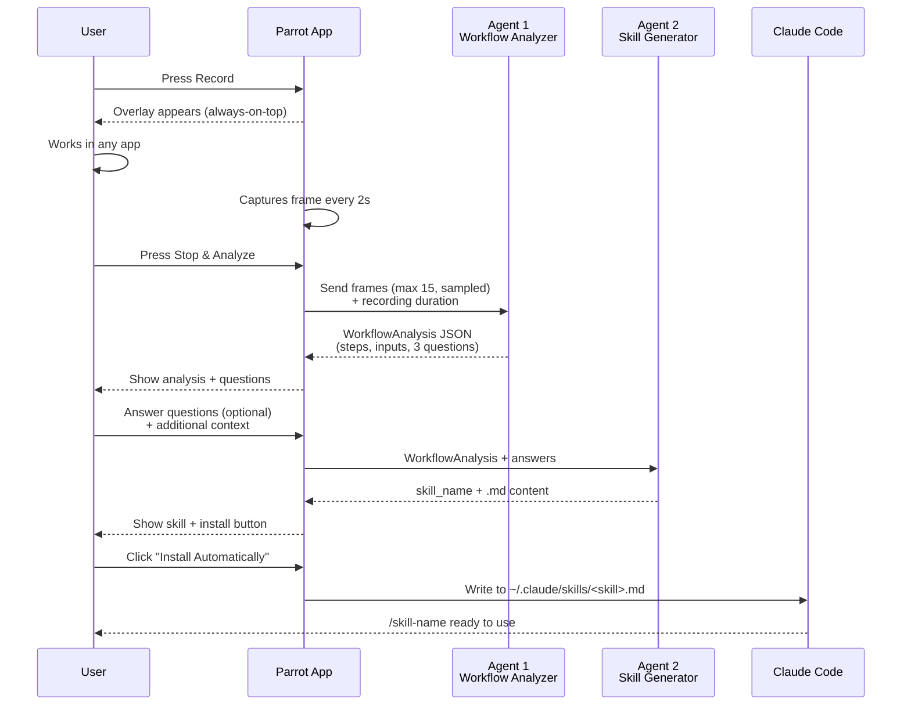
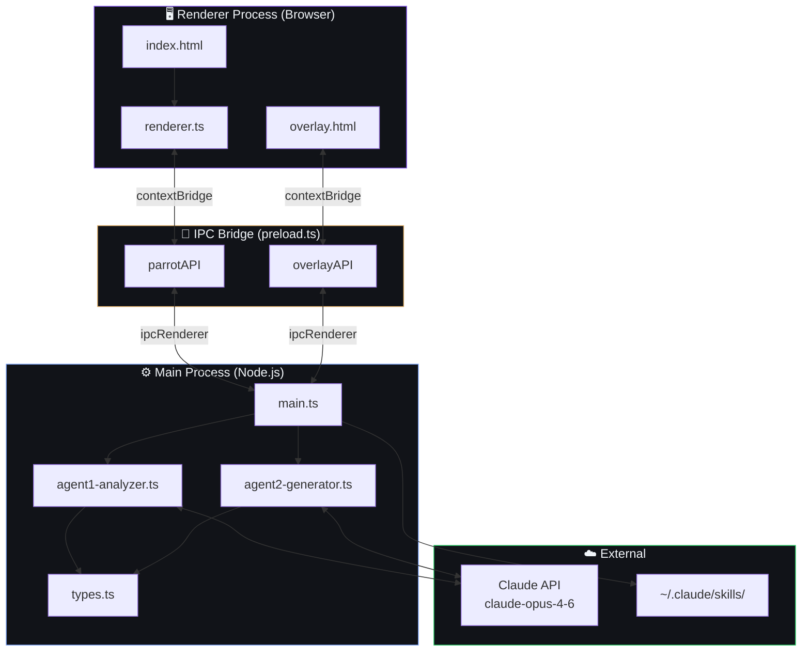
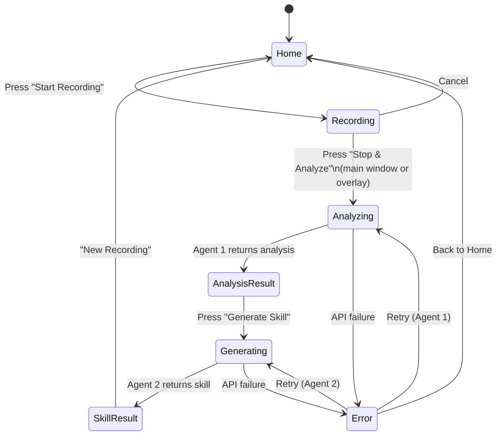
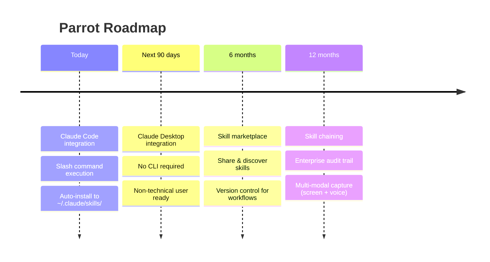

<](https://www.electronjs.org/)
[](https://www.typescriptlang.org/)
[](https://anthropic.com)
[](LICENSE)

</div>

---

## What is Parrot?

Parrot bridges the gap between **human expertise** and **AI execution**.

You record your screen while doing any repetitive workflow. Parrot's AI pipeline — powered by Claude — watches what you did, understands it semantically, and packages it into a `.md` skill file that Claude Code (and soon Claude Desktop) can execute on demand.

No code. No documentation. No engineering team in the middle.

---

## How it works


### Step 1 — Record
Open Parrot, press record, and just work. In any app — Chrome, Excel, your internal tools. Parrot captures your screen at 2-second intervals in the background. A floating overlay keeps you in control without interrupting your flow.

### Step 2 — AI Analyzes (Agent 1)
When you stop, Parrot sends the captured frames to Claude's vision model. Claude identifies the semantic meaning of each action — not "clicked at x,y" but "opened the export menu" — and extracts the workflow steps, variable inputs, and decision points. Then it asks you up to 3 clarifying questions to resolve ambiguity.

### Step 3 — Skill Generated (Agent 2)
A second Claude agent takes the analysis + your answers and generates a structured `.md` skill file: a portable, readable document describing exactly how to execute the workflow. One click installs it directly to `~/.claude/skills/`.

### Step 4 — Claude Executes
From any Claude Code session, type `/<skill-name>` and Claude runs the workflow — with full context of your steps, your variables, and your edge cases.

---

## AI Pipeline



---

## Architecture



---

## Skill File Format

The output is a `.md` file native to Claude Code's skill system:

```markdown
# export-monthly-report

Exports the monthly sales report from the dashboard and imports it into the template spreadsheet.

```yaml
name: export-monthly-report
version: '1.0'
description: |
  Navigates to the reports section, applies the current month filter,
  exports to CSV, and imports the data into the Google Sheets template.
context:
  apps:
    - Chrome
    - Google Sheets
  preconditions:
    - Logged into the sales dashboard
steps:
  - id: 1
    action: navigate
    target: dashboard > reports > monthly
    description: Go to the monthly reports section
  - id: 2
    action: select
    target: period filter
    value: "{{current_month}}"
  - id: 3
    action: click
    target: Export CSV button
    wait_for: download complete
inputs:
  - name: current_month
    type: date_month
    required: true
outputs:
  - name: report_file
    type: spreadsheet
```
```

---

## Project Structure

```
parrot/
├── src/
│   ├── main.ts                    # Electron main process + IPC handlers
│   ├── preload.ts                 # Main window context bridge
│   ├── overlay-preload.ts         # Overlay window context bridge
│   ├── ai/
│   │   ├── types.ts               # Shared TypeScript interfaces
│   │   ├── agent1-analyzer.ts     # Workflow analysis agent (vision)
│   │   └── agent2-generator.ts    # Skill generation agent (text)
│   └── renderer/
│       ├── index.html             # Main app UI (6 screens)
│       ├── overlay.html           # Floating recording indicator
│       └── renderer.ts            # UI logic + state management
├── specs/
│   └── features/                  # Spec-driven feature docs
├── parrot_vault/
│   └── ideas/                     # Vision & decision docs
├── .env.example                   # Environment variable template
└── package.json
```

---

## Screens



---

## Setup

### Prerequisites

- [Node.js](https://nodejs.org/) 18+
- [pnpm](https://pnpm.io/)
- An [Anthropic API key](https://console.anthropic.com/settings/keys)

### Install

```bash
git clone https://github.com/your-org/parrot.git
cd parrot
pnpm install
```

### Configure

```bash
cp .env.example .env
# Edit .env and add your ANTHROPIC_API_KEY
```

### Run

```bash
pnpm start
```

---

## Environment Variables

| Variable | Required | Description |
|---|---|---|
| `ANTHROPIC_API_KEY` | ✅ | Your Anthropic API key — get it at [console.anthropic.com](https://console.anthropic.com) |

---

## Tech Stack

| Layer | Technology |
|---|---|
| Desktop runtime | Electron 36 |
| Language | TypeScript 5 |
| AI models | claude-opus-4-6 (vision + text) |
| AI SDK | @anthropic-ai/sdk |
| Renderer bundler | esbuild |
| Package manager | pnpm |
| Fonts | JetBrains Mono, Rajdhani |

---

## Roadmap



---

## Contributing

1. Fork the repo
2. Create a feature branch: `git checkout -b feature/your-feature`
3. Follow the spec-first workflow in `specs/features/`
4. Submit a PR

---

## License

MIT © 2026 Parrot

---

<div align="center">

**Built at Hackathon 2026**

*The missing link between human workflows and AI agents.*

</div>
]]>
